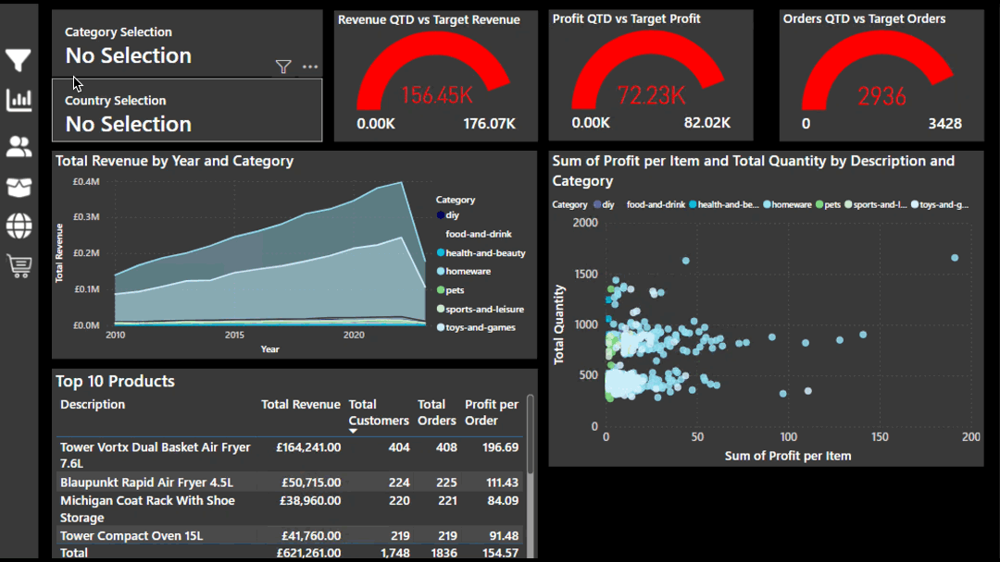
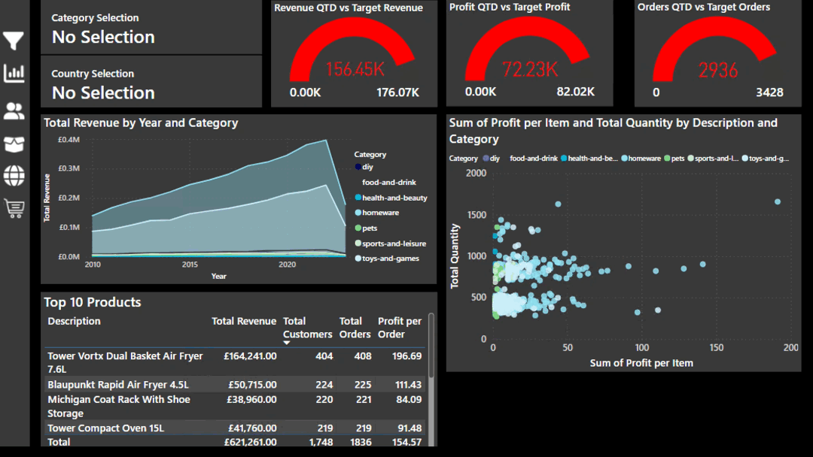

# Retail Analytics with Power BI

### Table of Contents
- [Overview](#Overview)
- [Data Extraction and Transformation](#data-extraction-and-transformation)
- [Data Modelling](#data-modelling)
- [The Report](#the-report)
  - [Executive Summary](#data-extraction-and-transformation)
  - [Customer Detail](#customer-detail)
  - [Product Detail](#product-detail)
  - [Stores Map](#stores-map)
  - [Stores Drillthrough](#stores-drillthrough)
- [SQL Metrics](#sql-metrics)
- [License](#license)

## Overview
This report analyses sales data from a medium-sized international retailer who has operations in multiple world regions. In this project, their data is centralised from disparate sources and transformed so that the analytics performed can help them to gain actionable insights into their business. The report provides an executive summary, more targeted analytics about customers and products as well as a map visual to illustrate regional performance.

## Data Extraction and Transformation
The source data was stored in 3 locations: an Azure SQL Database, a Microsoft Azure Blob Storage account and CSVs that are web-hosted. Once extracted, the data comprised of 4 tables: Orders, Products, Customers and Stores. Most columns were renamed to align with Power BI's naming conventions and duplicates were removed. The order date and shipping date columns in the orders table were split to separate out the date and time. 3 source tables were merged to create 1 stores table. In the stores table, the World Region column contained bad values, where the continent name was prefixed with 'ee'. The prefixes were removed and the continent names were preserved.
In order to enable the use of Power BI's time intelligence functions, a continuous date table was added to the database, which covered the entire time period of the extracted data.

## Data Modelling
The data model consists of 6 tables, 5 of which are modelled in a star schema and 1 of which is the measures table.

## The Report

### Executive Summary
This page of the report aims to give a sales overview of the entire business. It highlights total revenue, profit and number of orders made, as well as comparing quarterly target revenue and actual revenue. This report breaks down the total revenue by country and store type, as well as total orders by category. The table of products provides a deeper dive into the sales figures per item.

The user can interact with this dashboard to show figures by category of item or by country or store type.

### Customer Detail
On the customer detail report page, the data can be filtered by year using the green slicer at the bottom of the page. Not only does this page give us a high level overview of the customer base, but it's also possible to look at the top customers in a given date range.

Data can also be isolated by country, category and start of month date by selecting the relevant areas on the interactive charts.

### Product Detail
The product detail page provides an in-depth look at which products within the inventory are performing well. This data can be isolated for a particular category and/or country via the filters implementation, accessible via the filters icon as a pop-out toolbar.

Filtering product data for UK sales in the pets category

Filtering product data for German sales in the toys and games category

### Stores Map
The stores map enables a visual way to explore data by continent, region or store by the implementation of a geography hierarchy. The map has drill down enabled so that a user can interact with the visual to analyse multiple geographical levels. The size of the green bubbles represents the year-to-date profits for that particular area. The slicer at the top of the page allows for easy country selection.

Adding a tooltip provides a quick comparison view of the year-to-date profits and the profit goal for the given region. This example shows data for Falkirk in Scotland. This region has exceeded their profit goal of £72.58 by achieving an impressive £538.39 profit so far this year.

### Stores Drillthrough
From the stores map, the user can right-click and select to 'drill through' to a stores drillthrough page which contains profit, revenue and orders data. The page is interactive, so the user can choose to view sales data for a particular category by clicking the bar on the bar chart of the category that they want to analyse.

## SQL Metrics
More data insights were extracted without the use of Power BI or other visualisation tools in the form of SQL queries. The queries and their results are stored in the queries and queries_results directories respectively.

## License
This project is licensed under the MIT License.
